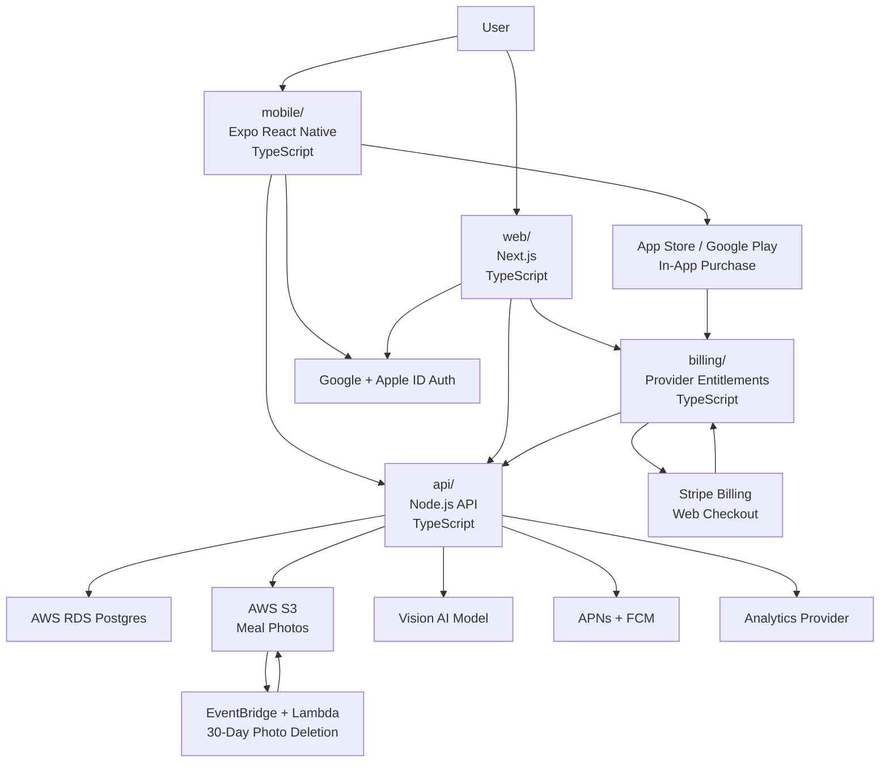

# Bitewise: Two-Phase Execution Plan

## Purpose

This document defines a small launchable V1 for Bitewise and a V2 release two months later.

The goal is to keep V1 focused enough to build quickly while still creating a real subscription product.

## Confirmed Decisions

- App name: Bitewise.
- Auth: Google and Apple ID only.
- Web billing: Stripe Billing.
- Mobile purchase options:
  - Option A: in-app purchase through App Store / Google Play.
  - Option B: link out to Stripe web checkout where store rules, region, and programme eligibility allow it.
- Hosting: AWS.
- Photo retention: delete meal photos 30 days after processing.
- V1 does not include a dashboard.
- V1 uses a simple Today view.

---

# 1. Product Design

## Phase 1: Launchable V1

### V1 Goal

Launch the smallest useful version of Bitewise:

1. Sign in.
2. Complete onboarding.
3. Start a trial through in-app purchase or an allowed web checkout link-out.
4. Add a meal from a photo.
5. Confirm or edit the estimate.
6. See today's calories and meals.

### V1 Product Principle

The user should understand today's food situation in under five seconds.

The app should answer:

> What did I eat today, and how many calories do I have left?

### V1 Platforms

Mobile:

- Primary V1 experience.
- iOS and Android.
- Photo capture and meal confirmation.

Web:

- Landing page.
- Authentication entry.
- Stripe checkout.
- Account/subscription management.

Web should not become a full duplicate of the mobile app in V1.

### V1 Screens

#### 1. Landing

Main message:

> Track calories from a photo. Stay on top of your daily diet.

CTA:

> Start free trial

#### 2. Auth

Supported providers:

- Google
- Apple ID

#### 3. Onboarding

Required fields:

- Age
- Gender
- Height
- Weight
- Goal: lose, maintain, gain
- Activity level
- Target pace: relaxed, standard, aggressive

Optional:

- Dietary restrictions/preferences

Outcome:

> Your daily target is X calories.

#### 4. Paywall

Offer:

- 14 days free.
- Then $10/month.
- Cancel anytime.

Billing providers:

- Stripe Billing on web.
- In-app purchase for iOS/Android store builds.
- Web checkout link-out only where compliant.

#### 5. Today View

V1 Today view includes:

- Daily calorie target.
- Calories consumed today.
- Calories remaining today.
- Meals logged today.
- Simple status message.
- Add Meal action.

V1 Today view excludes:

- Dashboard charts.
- Weekly analytics.
- Macro dashboard.
- Weight trend dashboard.
- Progress scoring.

#### 6. Add Meal

Flow:

1. User taps Add Meal.
2. User takes or uploads food photo.
3. Image uploads to AWS S3.
4. API creates a processing record.
5. AI estimation runs.
6. User sees result.
7. User confirms, edits, or retakes.
8. Meal appears in Today view.

Estimate result:

- Meal name.
- Estimated calories.
- Optional macros.
- Food components.
- Confidence level.

### V1 Alerts

Only three simple alert types:

- Optional meal logging reminder.
- Close-to-limit message after confirmed meal.
- Optional end-of-day summary.

No V1 trial campaign, coaching system, or advanced behavior reminders.

### V1 Metrics

Track:

- `registration_completed`
- `onboarding_completed`
- `trial_started`
- `first_meal_logged`
- `meal_confirmed`
- `meal_estimate_edited`
- `meal_estimate_failed`
- `trial_converted`
- `subscription_canceled`

Do not build a custom analytics dashboard in V1.

### V1 Non-Goals

Do not build:

- Full dashboard.
- Barcode scanning.
- Restaurant lookup.
- Apple Health or Google Fit.
- Weight tracking.
- Social features.
- Recipe builder.
- Grocery list.
- Advanced macro planning.
- Admin analytics dashboard.

## Phase 2: V2 Two Months Later

### V2 Goal

Improve retention and trust after the core meal logging loop is live.

### V2 Product Additions

Add:

- Weekly history.
- Repeat previous meal.
- Favorite meals.
- Edit past meals.
- Configurable reminder time.
- Trial ending reminder.
- Basic 7-day calorie average.
- Optional weight entry.

Still avoid:

- Clinical nutrition.
- Dietitian portal.
- Complex macro plans.
- Social/community.
- Enterprise plans.

### V2 Metrics

Add:

- `day_3_retained`
- `day_7_retained`
- `meals_logged_per_active_day`
- `weekly_active_users`
- `trial_to_paid_conversion`
- `monthly_churn`
- `estimate_latency_ms`
- `estimate_edit_delta_calories`
- `estimate_failure_rate`

---

# 2. Technical Implementation Plan

## Repository

Create the monorepo at:

```text
/Users/shai/git/bitewise
```

Folder structure:

```text
bitewise/
  mobile/
  web/
  api/
  billing/
```

## Programming Language Per Folder

| Folder | Primary language | Framework/runtime | Main responsibility |
| --- | --- | --- | --- |
| `mobile/` | TypeScript | Expo React Native | iOS/Android app, auth, onboarding, photo capture, meal review, Today view |
| `web/` | TypeScript | React 19 with Vite | Landing page, login entry, Stripe checkout/account access |
| `api/` | TypeScript | Node.js on AWS | User data, daily plan, meals, AI estimation, AWS storage, entitlement checks |
| `billing/` | TypeScript | Node.js on AWS | Stripe checkout, portal, webhooks, subscription state sync |

## Module 1: Mobile App

Folder:

```text
bitewise/mobile
```

Build:

- Expo app shell.
- Google auth.
- Apple ID auth.
- Onboarding flow.
- Today view.
- Add Meal flow.
- Photo capture/upload.
- Estimate review.
- Confirm/edit meal.

Acceptance criteria:

- User can sign in.
- User can complete onboarding.
- User can add a meal after entitlement is active.
- User can see today's meals and remaining calories.

## Module 2: Web App

Folder:

```text
bitewise/web
```

Build:

- Landing page.
- Sign-in entry.
- Stripe checkout redirect.
- Stripe customer portal entry.
- Account/subscription page.

Acceptance criteria:

- User can start checkout from web.
- User can manage subscription.
- Web remains lightweight.

## Module 3: API

Folder:

```text
bitewise/api
```

Build:

- Auth middleware.
- User profile endpoints.
- Onboarding endpoints.
- Calorie target calculation.
- Meal endpoints.
- Today view endpoint.
- Food photo upload URL endpoint.
- AI estimate endpoint or worker.
- Entitlement guard.
- AWS integration.

Core endpoints:

```text
GET /health
GET /me
POST /profile
POST /daily-plan
GET /today
POST /photos/upload-url
POST /meal-estimates
POST /meals
PATCH /meals/:id
DELETE /meals/:id
```

Acceptance criteria:

- API rejects unauthenticated requests.
- API rejects meal logging without active subscription/trial.
- API returns Today view data without a dashboard model.
- API can create and confirm AI meal estimates.

## Module 4: Billing

Folder:

```text
bitewise/billing
```

Build:

- Stripe product/price setup helper.
- Checkout session creation.
- Customer portal session creation.
- Stripe webhook handler.
- Apple/Google purchase verification interface.
- Provider-agnostic entitlement sync.
- Subscription state mapping.
- Trial state sync.

Subscription states:

```text
trialing
active
past_due
canceled
expired
unknown
```

Acceptance criteria:

- Stripe webhook signatures are verified.
- Trial starts correctly.
- Subscription state syncs into API/database.
- Canceled/expired users cannot log new meals.
- App Store / Google Play purchase state can unlock the same `premium` entitlement.
- Web link-out is feature-flagged and region/programme gated.

## Module 5: AWS Infrastructure

Can live as scripts or IaC later. For V1, keep infrastructure simple.

Recommended services:

- S3 for meal photos.
- RDS Postgres for data.
- ECS Fargate or Lambda for API.
- Lambda for billing webhooks if separated from API.
- EventBridge Scheduler for 30-day photo deletion.
- CloudWatch logs and alarms.
- Secrets Manager for secrets.

Acceptance criteria:

- Staging environment exists.
- Production environment exists.
- S3 lifecycle or scheduled cleanup deletes processed photos after 30 days.
- Secrets are not stored in repo.

## Module 6: AI Estimation

Prefer implementing inside `api/` first. Split into its own worker later only if needed.

Build:

- Vision model request.
- Structured JSON schema.
- Output validation.
- Error fallback.
- Confidence label.

Acceptance criteria:

- Valid photo returns estimate.
- Invalid photo returns friendly failure.
- User can edit before confirming.

## Module 7: Notifications

V1 minimal implementation:

- Optional meal reminder.
- Close-to-limit message after confirmed meal.
- Optional end-of-day summary.

Acceptance criteria:

- Notifications can be disabled.
- Quiet hours are respected.
- No notification spam.

## Module 8: Analytics

Use provider events. Do not build internal dashboard.

Track only V1 events:

```text
registration_completed
onboarding_completed
trial_started
first_meal_logged
meal_confirmed
meal_estimate_edited
meal_estimate_failed
trial_converted
subscription_canceled
```

---

# 3. High-Level Component Diagram



---

# 4. Tools and Technologies

## Mobile

- TypeScript.
- Expo React Native.
- Expo Router.
- TanStack Query.
- Expo Camera or Image Picker.
- Expo Notifications.

## Web

- TypeScript.
- React 19.
- Vite.
- React.
- Stripe.js.

## API

- TypeScript.
- Node.js.
- Fastify or NestJS.
- Zod.
- Prisma.
- Postgres.
- AWS SDK.

## Billing

- TypeScript.
- Stripe Billing.
- Stripe Checkout.
- Stripe Customer Portal.
- Stripe webhooks.
- Apple/Google purchase verification adapter.
- Provider-agnostic entitlement mapping.

## AWS

- S3.
- RDS Postgres.
- ECS Fargate or Lambda.
- EventBridge Scheduler.
- CloudWatch.
- Secrets Manager.

## AI

- Vision-capable AI model.
- Structured JSON response.
- Server-side schema validation.

---

# 5. Redesigned Agent Work

## Agent 1: Repo and Foundation

Folder:

```text
bitewise/
```

Scope:

- Monorepo setup.
- Package manager.
- TypeScript config.
- Shared lint/test config.
- Environment structure.

Deliverable:

- Repo boots locally with placeholder apps.

## Agent 2: Mobile App

Folder:

```text
bitewise/mobile
```

Scope:

- Expo setup.
- Auth UI.
- Onboarding UI.
- Today view.
- Add Meal flow.
- Estimate review UI.

Deliverable:

- Mobile app can complete the V1 user journey using mocked API responses.

## Agent 3: Web and Stripe Entry

Folder:

```text
bitewise/web
```

Scope:

- Landing page.
- Login entry.
- Checkout redirect.
- Subscription/account page.

Deliverable:

- User can reach Stripe checkout from web.

## Agent 4: API and Data

Folder:

```text
bitewise/api
```

Scope:

- API framework.
- Auth middleware.
- Database schema.
- Onboarding endpoints.
- Today view endpoint.
- Meal endpoints.
- Entitlement guard.

Deliverable:

- API supports onboarding, meal creation, and Today view.

## Agent 5: Billing

Folder:

```text
bitewise/billing
```

Scope:

- Stripe Checkout.
- Customer portal.
- Webhook verification.
- Subscription state mapping.
- API sync.

Deliverable:

- Stripe trial and subscription state unlocks or blocks meal logging.

## Agent 6: AI and Photo Storage

Folder:

```text
bitewise/api
```

Scope:

- S3 upload URL.
- Photo processing status.
- AI estimate call.
- Estimate schema validation.
- 30-day deletion scheduling.

Deliverable:

- User can upload photo and receive editable meal estimate.

## Agent 7: AWS Deployment

Folder:

```text
bitewise/api
bitewise/billing
```

Scope:

- AWS staging environment.
- AWS production environment.
- Secrets Manager.
- Logs and alarms.
- S3 lifecycle or scheduled cleanup.

Deliverable:

- API and billing services run in AWS.

## Agent 8: QA and Release

Folder:

```text
bitewise/
```

Scope:

- V1 smoke tests.
- Payment tests.
- Auth tests.
- AI estimate tests.
- Mobile release checklist.

Deliverable:

- V1 is ready for beta.

---

# 6. Practical Next Steps

1. Initialize `/Users/shai/git/bitewise` as a Git repo.
2. Choose package manager: pnpm is recommended.
3. Scaffold Expo in `mobile/`.
4. Scaffold Next.js in `web/`.
5. Scaffold Node.js API in `api/`.
6. Scaffold Stripe webhook service in `billing/`.
7. Add shared environment conventions.
8. Build the first mocked vertical slice.
9. Add Stripe Billing.
10. Add real photo upload and AI estimation.
