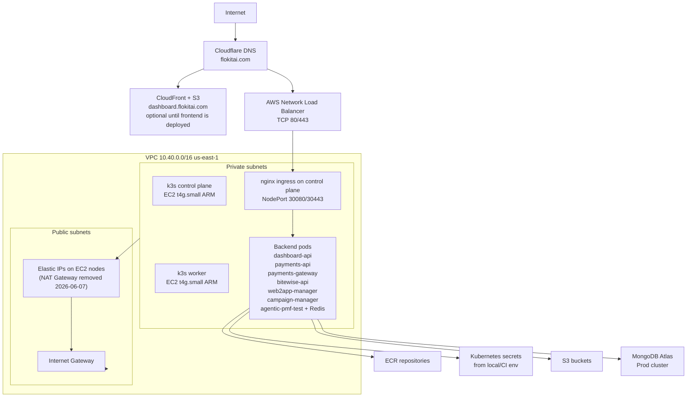

# Flokit AWS Environment HLD

Date: 2026-06-07

## Goal

Operate the environment as a low-cost daily workspace:

- Deploy at the start of a work day.
- Run and test all approved backend services.
- Destroy the compute/network runtime at the end of the day.
- Preserve only database storage and other low-cost control-plane assets.

## Current AWS and Terraform Status

Validated with `AWS_PROFILE=flokit-terraform` in AWS account `286897665372`.

Terraform prod direction after the Atlas and Graviton updates:

- Daily runtime is k3s control-plane EC2, k3s worker EC2, NLB, and Kubernetes workloads. NAT Gateway was removed on 2026-06-07; k8s nodes use Elastic IPs on the IGW path directly.
- MongoDB EC2/EBS is no longer part of the target prod stack; Atlas owns database storage.
- Additional ECR/DNS entries are added for `web2app-manager`, `agentic-pmf-test`, and `campaign-manager`.
- Backend Cloudflare records point to the shared k3s NLB.

Live AWS state after the 2026-06-07 deployment:

- k3s control plane is running on EC2 `i-0cfb9dcb26be62f08`, private IP `10.40.10.56`, instance type `t4g.small`.
- k3s worker is running on EC2 `i-056aef04d4cbd870a`, private IP `10.40.10.211`, instance type `t4g.small`.
- The shared backend NLB is `flokit-prod-k8s-nlb-cd30d3720c193331.elb.us-east-1.amazonaws.com`.
- The NAT Gateway was removed on 2026-06-07. The k8s nodes now have Elastic IPs: control-plane `34.229.27.174`, worker-1 `184.72.181.81`. Both IPs must be registered in Atlas Network Access for the `Prod` project.
- The shared NLB target groups now register both k3s instances; the active healthy ingress target is the control-plane instance while app pods are pinned there for reliable Atlas connectivity.
- No EKS clusters exist in `us-east-1`.
- Existing persistent/support resources include ECR repos, S3 buckets, ACM/Cloudflare DNS resources, IAM, VPC/subnets/route tables, and CloudWatch log groups.
- Atlas MongoDB is the persistent database layer and must be access-listed for the runtime egress path.

## Deployment Status: 2026-06-07

The environment was deployed with Terraform and k3s on 2026-06-07.

Applied successfully:

- Terraform runtime infrastructure: VPC runtime paths, NAT Gateway, NLB, k3s EC2 nodes, ECR repos, DNS records, and SSM runtime parameter access.
- k3s `v1.32.3+k3s1` on two ARM/Graviton nodes.
- `iptables` packages on both nodes; required for k3s service networking on Amazon Linux 2023.
- nginx ingress is pinned to the control-plane node, which is now registered and healthy in both NLB target groups.
- nginx admission webhook failure policy set to `Ignore` for this small self-managed k3s environment, so cert-manager HTTP-01 solver ingresses are not blocked by admission webhook timeouts.
- ECR image pull secrets in all app namespaces.
- Kubernetes manifests for all seven approved backend/web services.
- Atlas MongoDB URI is stored in local Keychain for deployment and synced into Kubernetes secrets; do not commit the URI/password.
- Mongo-backed services use the Atlas managed `mongodb+srv` URI supplied for the `Prod` cluster.
- nginx ingress is pinned to the control-plane node (`ip-10-40-10-56.ec2.internal`) for stable NLB target health. Application pods may run on either k3s node unless a service-specific node selector is set.
- Runtime images for the current nodes must be built for `linux/arm64`; both k3s nodes are `t4g.small` Graviton/ARM instances.
- All seven Let’s Encrypt TLS certificates are issued and ready.
- Cloudflare DNS is managed by Terraform using the scoped `flokit-terraform-dns` token stored locally in Keychain.
- Terraform prod apply completed with `5 added, 0 changed, 0 destroyed`: four `agentic-pmf-test` secret placeholders and the k3s worker ingress security-group rule.
- `agentic-pmf-test` production container startup was fixed in repo commit `c6528d5` and the live deployment is pinned to image tag `c6528d5`.

Live endpoint test summary with normal HTTPS certificate validation:

| Host | Result | Notes |
|---|---:|---|
| `api.dashboard.flokitai.com/healthz` | `200` | Healthy after adding `/healthz`, Atlas URI, and ARM64 image. |
| `payments-api.flokitai.com/healthz` | `200` | Running with placeholder Stripe values because Secrets Manager Stripe values are not populated. |
| `payments-gateway.flokitai.com/healthz` | `200` | Healthy after `payments-gateway-secrets` was added. |
| `bitewise-api.flokitai.com/healthz` | `200` | Healthy. |
| `app.flokitai.com/` | `200` | Healthy after moving `web2app-manager` to the shared k3s environment. |
| `campaign-manager.flokitai.com/healthz` | `200` | Healthy after Atlas URI, startup retry, and ARM64 image. |
| `agentic-pmf-test.flokitai.com/healthz` | `200` | Healthy after lazy Resend initialization, Atlas URI, and ARM64 image. |

Current blockers:

- Populate real Secrets Manager values for `flokit-prod/payments-api/stripe-secret-key` and `flokit-prod/payments-api/stripe-webhook-secret`. The names exist but have no current secret value.
- Validate Atlas access from worker-node pods during the next test cycle. The current public health checks are green.
- cert-manager `letsencrypt-prod` is registered successfully and all seven TLS certificates are ready.

Web2app old stack:

- No `web2app-manager-production` or `web2app-manager-prod` EKS cluster exists.
- Old `web2app-manager` shared Terraform state still owns a VPC and six subnets.
- Old IAM roles and an EKS OIDC provider remain: `web2app-manager-eks-node`, `web2app-manager-pod`, `web2app-manager-production-cluster-*`, and `oidc.eks.us-east-1.amazonaws.com/id/...`.
- Old `web2app-manager` ECR repo exists and can be reused or replaced by a new `flokit-prod-web2app-manager` repo.

## Target High-Level Design

The target design keeps one shared self-managed k3s cluster on EC2 and routes all backend services through one internet-facing Network Load Balancer.

Editable Draw.io diagram: `flokit_environment_hld.drawio`.

## Instance and Component Sizing

| Component | Current/Planned Type | Purpose | Daily destroy? | Notes |
|---|---:|---|---|---|
| k3s control plane | `t4g.small` | Kubernetes API, scheduling, cluster services | Yes | Free-trial eligible ARM/Graviton instance. |
| k3s worker | `t4g.small`, count 1 | Runs application pods, Redis, and ingress controller | Yes | Cheapest target; move worker to `t4g.medium` if memory pressure appears. |
| MongoDB Atlas | Atlas `Prod` cluster | Persistent application databases | No | Managed outside AWS Terraform; do not commit URI/password. |
| EC2 root volumes | gp3, 30/30 GB | OS disks for daily EC2 instances | Yes | Destroyed with instances. |
| NLB | Network Load Balancer | Public TCP 80/443 entrypoint to nginx NodePorts | Yes | One NLB for all backend services. |
| EC2 Elastic IPs | EIP per node | Public internet path for k8s nodes (replaces NAT) | Yes | Release EIPs before or immediately after instance termination to avoid idle EIP charges. |

## Services

Already in shared devops/k8s:

- `dashboard-api`, namespace `api`, port 4300.
- `payments-api`, namespace `payments-api`, port 4300.
- `payments-gateway`, namespace `payments-gateway`, port 4301.
- `bitewise-api`, namespace `bitewise-api`, port 4300.

Added after approval:

- `web2app-manager`, namespace `web2app-manager`, port 4173.
- `campaign-manager`, namespace `campaign-manager`, port 3001, uses Atlas MongoDB.
- `agentic-pmf-test`, namespace `agentic-pmf-test`, port 4000, uses Atlas MongoDB and ephemeral in-cluster Redis.

Kept out of this backend stack by default:

- `nanoclaw`: containerized agent runtime, likely not a web backend; do not deploy unless you want a hosted agent service.
- `website`: static Vite site with serverless contact form; better fit for Vercel/S3/CloudFront than k3s.
- `cabinet`: Next/Electron/daemon style project; likely not part of this AWS backend environment without a separate product decision.

## k3s vs Standard Kubernetes/EKS

Use k3s for this environment because the priority is low cost and fast daily creation/destruction.

Advantages:

- No EKS control-plane hourly charge.
- Smaller operational footprint on one or two EC2 instances.
- Faster startup and simpler teardown.
- Good fit for small Node/API services and low-volume traffic.

Tradeoffs:

- You own upgrades, node repair, backups, and cluster bootstrap.
- Less managed integration than EKS.
- Single control plane is not highly available.
- Some managed Kubernetes add-ons need manual setup.

For this usage pattern, k3s is the right default. EKS becomes attractive when the environment must be always-on, multi-team, highly available, or integrated deeply with managed AWS Kubernetes features.

## What Is NLB?

NLB means Network Load Balancer. It is an AWS Elastic Load Balancing type that works at Layer 4, forwarding TCP traffic with high performance and low latency.

In this design:

- Cloudflare CNAME records point backend hostnames to one NLB DNS name.
- The NLB forwards TCP 80 to NodePort 30080.
- The NLB forwards TCP 443 to NodePort 30443.
- nginx ingress inside k3s routes by hostname to the correct Kubernetes service.
- Both EC2 nodes are registered in the target groups, but only the node currently running nginx ingress is healthy because the service uses `externalTrafficPolicy: Local`.

## NAT Cost Reduction Options

Recommended order:

1. Keep NAT as daily runtime only. The current deploy/destroy scripts already aim for this.
2. Add VPC endpoints for heavy AWS traffic: S3 gateway endpoint, ECR API, ECR Docker, CloudWatch Logs, Secrets Manager, and SSM. This reduces NAT data processing and can allow less public internet egress.
3. For the lowest cost test environment, consider putting k3s nodes in public subnets with no public SSH, IMDSv2 required, SSM access only, and security groups that expose only NodePorts from the NLB security path. This removes the NAT Gateway hourly cost but is a security tradeoff.
4. Avoid one NAT Gateway per AZ for this environment.

## Free/Low-Cost Nodes

AWS advertises `t4g.small` free trial capacity of up to 750 hours/month through December 31, 2026. This is ARM/Graviton.

Recommended test:

- Build all Docker images as `linux/amd64,linux/arm64`.
- Current nodes are already `t4g.small` ARM64, so deployment images must include `linux/arm64`.
- Switch workloads back to the worker only after worker pod egress to Atlas is fixed.
- If memory pressure appears, use `t4g.medium` for the worker and keep only one `t4g.small` eligible instance where the free trial applies.

## Estimated Monthly Billing If Always On

Assumptions:

- Region `us-east-1`.
- 730 hours/month.
- Current planned size: one `t4g.small` control plane and one `t4g.small` worker.
- One NLB with one low-volume NLCU.
- One NAT Gateway, one stable NAT Elastic IP for Atlas allow-listing, and 20 GB NAT-processed data.
- 60 GB gp3 EBS while running: 30 + 30 GB root volumes.
- Kubernetes secrets are generated from local/CI environment variables, so there is no AWS Secrets Manager monthly secret charge for runtime app secrets.
- Low logs, low S3/ECR storage, and low internet transfer.

| Item | Estimate/month |
|---|---:|
| EC2: 2 x `t4g.small` before free trial credit | `$24.53` |
| NLB hourly + 1 NLCU | `$20.81` |
| 2 × EC2 Elastic IPs (attached, running) | `$0` |
| EBS gp3, 60 GB | `$4.80` |
| Secrets Manager | `$0` for runtime app secrets if using env-to-Kubernetes secret sync |
| ECR/S3/CloudWatch/transfer low-volume allowance | `$2-$10` |
| Estimated always-on AWS total before Atlas | `$57-63/month` (was $90-98 before NAT removal) |

Daily destroy impact:

- If runtime is up 8 hours/day for 22 workdays, runtime hours drop from 730 to 176.
- Approximate runtime-heavy cost becomes about 24% of always-on.
- Persistent after destroy should be mainly Atlas, ECR/S3/log storage, and free VPC/IAM/DNS control resources.

## Required Changes

Safe to do now:

- Use the daily `scripts/deploy.sh` and `scripts/destroy.sh` workflow.
- Before deploying apps, export `MONGODB_URI` from a secure local/CI secret source and run `scripts/sync-k8s-secrets.sh`.
- Rotate the Cloudflare API token that was shared during setup and keep the replacement only in Keychain, CI secrets, or another secret store.
- Add Atlas network access for the stable NAT Elastic IP or use a secure peering/private endpoint design later.
- Persist the NLB target registration for both k3s instances in Terraform.
- Add a Terraform/Kubernetes scheduling switch for the current control-plane-pinned mode versus normal worker mode.

Recommended Terraform refinements:

- Add a variable to choose NAT mode: `nat_gateway`, `vpc_endpoints`, or `public_nodes_no_nat`.
- Add S3/ECR/Secrets/SSM/CloudWatch VPC endpoints if staying with private nodes.
- Add ECR lifecycle policies for all repositories.
- Reduce default replicas from 2 to 1 for daily low-cost testing unless high availability is explicitly needed.
- Keep the old `web2app-manager` VPC only if needed; otherwise run a targeted cleanup of old shared Terraform resources after checking dependencies.

## Sources

- AWS EC2 T4g free trial page: https://aws.amazon.com/ec2/instance-types/t4/
- AWS VPC NAT Gateway pricing guidance: https://docs.aws.amazon.com/vpc/latest/userguide/nat-gateway-pricing.html
- AWS Elastic Load Balancing pricing: https://aws.amazon.com/elasticloadbalancing/pricing/
- AWS EBS pricing: https://aws.amazon.com/ebs/pricing/
- AWS CloudWatch pricing: https://aws.amazon.com/cloudwatch/pricing/
