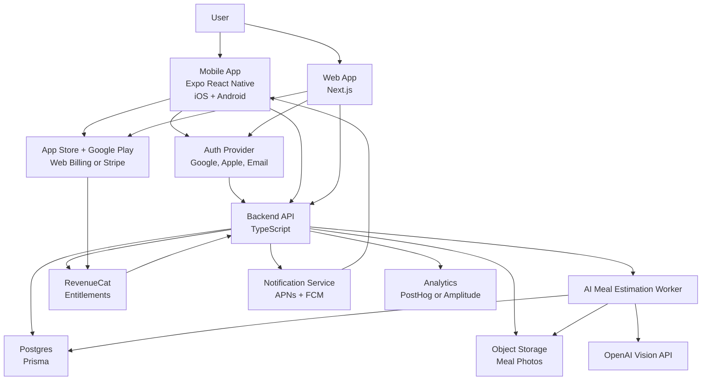

# AI Calorie & Diet Tracker: Two-Phase Execution Plan

## Purpose

This document reduces the original app scope into two practical phases:

- V1: a launchable first version focused on the core habit loop.
- V2: a follow-up release two months later that adds smarter retention, deeper insights, and broader product polish.

The plan is written so work can be split between coding agents or engineering owners by module.

## Assumptions

- Mobile is the primary experience.
- Web exists in V1, but should be lightweight.
- The product has no meaningful free tier. Users start a 14-day trial, then pay $10/month.
- The first version optimizes for fast meal logging and daily calorie awareness, not perfect nutrition science.
- V1 should avoid advanced metrics, complex reminders, social features, coaching programs, medical claims, and heavy macro planning.

---

# 1. Product Design

## Phase 1: Launchable V1

### V1 Goal

Launch a simple subscription app that lets a user:

1. Create an account.
2. Set a daily calorie target.
3. Start a 14-day trial.
4. Take or upload a food photo.
5. Receive an estimated meal result.
6. Confirm or lightly edit the meal.
7. See today's calorie progress.

### V1 Product Principle

The V1 product should answer one question quickly:

> How much have I eaten today, and how much room do I have left?

### V1 Platforms

Mobile:

- iOS
- Android
- Full V1 functionality

Web:

- Landing page
- Login
- Simple dashboard
- Account/subscription access
- No need for full photo-first workflow in V1, unless upload is easy to include

### V1 User Flow

1. Landing or app store page
2. Sign up or log in
3. Onboarding questionnaire
4. Suggested calorie target
5. Trial paywall
6. Daily dashboard
7. Add meal by photo
8. Confirm estimate
9. Dashboard updates

### V1 Screens

#### 1. Landing Page

Primary message:

> Track calories from a photo. Stay on top of your daily diet.

Main CTA:

> Start free trial

Content should stay short:

- Take a photo of your meal.
- Get a calorie estimate.
- Track your daily target.
- 14 days free, then $10/month.

#### 2. Authentication

V1 auth methods:

- Google sign-in
- Apple sign-in
- Email login fallback

#### 3. Onboarding

Required fields:

- Age
- Gender
- Height
- Weight
- Goal: lose, maintain, gain
- Activity level
- Target pace: relaxed, standard, aggressive

Optional field:

- Dietary restrictions/preferences

Outcome:

> Your daily target is X calories.

The user can accept or manually adjust the target.

#### 4. Paywall

Timing:

- After onboarding
- Before full product usage

Offer:

- 14-day free trial
- Then $10/month
- Cancel anytime

Paywall message:

> Track meals from photos, stay within your calorie target, and build better eating habits.

#### 5. Daily Dashboard

V1 dashboard elements:

- Daily calorie target
- Calories consumed
- Calories remaining
- Simple progress ring/bar
- Meals logged today
- One status message

Example statuses:

- On track: "850 calories remaining today."
- Near limit: "250 calories left today."
- Over target: "180 calories over today."

Avoid in V1:

- Weekly trend charts
- Detailed macro dashboards
- Streak systems
- Weight tracking
- Meal scoring
- Behavioral coaching timelines

#### 6. Add Meal

Flow:

1. Tap Add Meal.
2. Take photo or upload image.
3. Show loading state.
4. Show AI estimate.
5. User confirms, edits, or retakes.

Estimate result:

- Meal name
- Estimated calories
- Optional protein, carbs, fat
- Food components
- Confidence label: low, medium, high

Actions:

- Confirm
- Edit
- Retake

V1 edit fields:

- Meal name
- Calories
- Protein, optional
- Carbs, optional
- Fat, optional

#### 7. Meal History

V1 history should be simple:

- Today only on the dashboard
- A basic previous-days list is acceptable if cheap to build

### V1 Alerts

Keep alerts minimal.

V1 includes only:

1. Meal logging reminder
   - Sent if the user has not logged any meal by a chosen time.
   - Default: one daily reminder around lunch or evening.

2. Close-to-limit alert
   - Triggered after confirming a meal if remaining calories are below a threshold.
   - Default threshold: less than 300 calories remaining.

3. End-of-day summary
   - One simple summary in the evening.
   - Example: "You logged 1,820 calories today. 180 under target."

V1 excludes:

- Multiple daily nudges
- Overeating recovery suggestions
- Trial lifecycle notification campaigns
- Personalized coaching messages
- Smart recommendations based on behavior

### V1 Metrics

Track only the metrics needed to validate the core product:

- `registration_completed`
- `onboarding_completed`
- `trial_started`
- `first_meal_logged`
- `meal_confirmed`
- `day_1_retained`
- `trial_converted`

Optional but useful:

- `meal_estimate_edited`
- `meal_estimate_failed`
- `subscription_canceled`

V1 success signal:

> At least 40% of trial users log one meal on their first day.

Secondary signal:

> At least 25% of trial users return and log another meal within 24 hours.

### V1 Non-Goals

Do not build in V1:

- Barcode scanning
- Restaurant menu lookup
- Apple Health / Google Fit integration
- Weight tracking
- Social sharing
- Recipes
- Grocery lists
- Advanced macros
- Wearable integrations
- Food database search as a primary flow
- Medical or clinical diet plans
- Admin analytics dashboards beyond basic event exports

---

## Phase 2: V2 Two Months Later

### V2 Goal

Improve retention, trust, and subscription conversion after the basic product loop is proven.

### V2 Product Additions

#### 1. Smarter Meal History

Add:

- Weekly view
- Reuse previous meals
- Duplicate meal
- Favorite meals
- Edit past meals

Purpose:

- Reduce friction for repeat foods.
- Improve perceived reliability.

#### 2. Better Insights

Add lightweight insights:

- 7-day average calories
- Days on target
- Most common meals
- Average calories by meal time

Avoid heavy analytics dashboards. The insight should be readable in under 10 seconds.

#### 3. Improved Alerts

Add:

- Trial ending reminder on day 11 or 12
- Positive reinforcement after several logged days
- Gentle suggestion after repeated over-target days
- Configurable reminder time

Still avoid guilt-based messaging.

#### 4. Food Estimate Learning

Add:

- Track user corrections.
- Remember common corrected meals.
- Improve repeat estimates by matching similar previous meal names/components.

Do not train a custom model in V2 unless volume justifies it.

#### 5. Progress Layer

Add:

- Optional weight entry
- Simple progress chart
- Goal review prompt every 2-4 weeks

This should remain secondary to meal logging.

### V2 Metrics

Add product-health metrics:

- `day_3_retained`
- `day_7_retained`
- `meals_logged_per_active_day`
- `weekly_active_users`
- `trial_day_7_active`
- `trial_to_paid_conversion`
- `monthly_churn`

Add AI quality metrics:

- `estimate_latency_ms`
- `estimate_confidence`
- `estimate_edit_delta_calories`
- `estimate_failure_rate`

### V2 Non-Goals

Still delay:

- Clinical nutrition workflows
- Dietitian portal
- Complex macro planning
- Community/social features
- Enterprise or employer plans
- Deep integrations unless retention data strongly supports them

---

# 2. Technical Implementation Plan

## Recommended Repo Structure

Use a monorepo so shared types and business logic can be reused.

```text
apps/
  mobile/
  web/
  api/
packages/
  shared/
  database/
  ai/
  billing/
  notifications/
  analytics/
```

## Module 1: Shared Types and Validation

Owner: shared/platform agent

Build:

- Shared TypeScript types
- Zod schemas for API inputs and AI outputs
- Shared constants for goals, activity levels, target pace, meal status

Key files:

```text
packages/shared/src/types.ts
packages/shared/src/schemas.ts
packages/shared/src/constants.ts
```

Core objects:

- `UserProfile`
- `DailyPlan`
- `Meal`
- `MealEstimate`
- `SubscriptionStatus`
- `DashboardSummary`

Acceptance criteria:

- Mobile, web, and API import the same types.
- Invalid API input is rejected consistently.
- AI output is validated before it is saved.

## Module 2: Database

Owner: backend/database agent

Build Postgres schema using Prisma.

V1 tables:

```text
users
profiles
daily_plans
subscriptions
meals
meal_items
food_photos
notification_preferences
analytics_events
```

Important rules:

- A user has one active profile.
- A user has one active daily plan.
- Meals belong to a user and a calendar date.
- Meal dates should be stored with user timezone awareness.
- Food photos can be deleted later without deleting the meal.

Acceptance criteria:

- Prisma migrations run from a clean database.
- Seed script creates a test user and sample meals.
- All tables have created/updated timestamps.

## Module 3: Authentication

Owner: auth agent

Build:

- Google login
- Apple login
- Email fallback
- Session handling across mobile and web
- Backend user creation on first login

Implementation notes:

- Use one external auth provider across mobile and web.
- Store provider user ID in the backend `users` table.
- Never use the billing provider as the source of identity.

Acceptance criteria:

- User can log in on mobile.
- Same user can log in on web.
- Backend can resolve `currentUser` from the auth token.

## Module 4: Onboarding and Calorie Target

Owner: onboarding agent

Build:

- Onboarding form
- Calorie target calculation
- Manual target override
- Create/update profile API
- Create active daily plan API

V1 calorie target:

- Use a standard BMR/TDEE calculation.
- Adjust target by goal and pace.
- Keep the calculation explainable and deterministic.

Suggested target adjustments:

```text
lose + relaxed: -250 kcal/day
lose + standard: -500 kcal/day
lose + aggressive: -750 kcal/day
maintain: 0 kcal/day
gain + relaxed: +200 kcal/day
gain + standard: +350 kcal/day
gain + aggressive: +500 kcal/day
```

Acceptance criteria:

- User completes onboarding and receives a calorie target.
- User can manually adjust the target.
- Dashboard can read the active plan.

## Module 5: Billing and Entitlements

Owner: billing agent

Build:

- Products: monthly subscription with 14-day trial
- Entitlement: `premium`
- Mobile purchase flow
- Restore purchases
- Webhook receiver
- Backend subscription state sync

Recommended approach:

- Use RevenueCat for cross-platform entitlement state.
- Use App Store billing for iOS.
- Use Google Play Billing for Android.
- Use RevenueCat Web Billing or Stripe for web.

Backend subscription states:

```text
trialing
active
expired
canceled
billing_issue
unknown
```

Acceptance criteria:

- User cannot access meal logging without trial or active subscription.
- Trial users can access full V1 functionality.
- Subscription status updates from webhook events.
- Restore purchases works on mobile.

## Module 6: Meal Photo Upload

Owner: media agent

Build:

- Mobile camera capture
- Image picker upload
- Backend signed upload URL
- Object storage upload
- `food_photos` record creation

Implementation notes:

- Resize/compress image before upload.
- Strip unnecessary metadata where possible.
- Store original photo only if needed for user experience.
- V1 can delete source images after a retention window.

Acceptance criteria:

- User can take a photo and upload it.
- Backend stores photo processing status.
- Failed uploads show a recoverable error.

## Module 7: AI Meal Estimation

Owner: AI estimation agent

Build:

- Background job or API worker
- Vision model request
- Structured JSON response validation
- Meal estimate normalization
- Confidence label
- Error fallback

Prompt output schema:

```json
{
  "mealName": "string",
  "estimatedCalories": 620,
  "confidence": "low | medium | high",
  "items": [
    {
      "name": "chicken breast",
      "estimatedCalories": 240,
      "proteinGrams": 38,
      "carbsGrams": 0,
      "fatGrams": 8
    }
  ],
  "macros": {
    "proteinGrams": 38,
    "carbsGrams": 55,
    "fatGrams": 22
  },
  "notes": "Approximate estimate based on visible food."
}
```

Validation rules:

- Calories must be positive.
- Total meal calories should be within a reasonable human meal range.
- If the model is uncertain, mark confidence as low.
- Do not block confirmation only because confidence is low.

Acceptance criteria:

- Valid photo returns an editable estimate.
- Invalid or unclear photo returns a friendly failure state.
- AI response is never saved unless it passes schema validation.

## Module 8: Meal Confirmation and Editing

Owner: meal logging agent

Build:

- Estimate review screen
- Confirm meal API
- Edit estimate API
- Retake flow
- Dashboard refresh after confirmation

V1 APIs:

```text
POST /meal-estimates
GET /meal-estimates/:id
POST /meals
PATCH /meals/:id
DELETE /meals/:id
GET /dashboard/today
```

Acceptance criteria:

- User can confirm an estimate.
- User can edit calories before confirming.
- Confirmed meal appears on today's dashboard.
- Deleting a meal updates daily totals.

## Module 9: Daily Dashboard

Owner: dashboard agent

Build:

- Today's summary API
- Mobile dashboard UI
- Web dashboard UI
- Daily status calculation

Dashboard calculation:

```text
consumed = sum(today.confirmedMeals.calories)
remaining = target - consumed
status =
  remaining > 300: on_track
  remaining >= 0 and remaining <= 300: close_to_limit
  remaining < 0: over_target
```

Acceptance criteria:

- Dashboard loads under normal network conditions.
- Dashboard updates immediately after meal confirmation.
- Status message is clear and non-judgmental.

## Module 10: V1 Notifications

Owner: notifications agent

Build only the three V1 alert types:

- One meal logging reminder
- Close-to-limit alert after meal confirmation
- End-of-day summary

Implementation notes:

- Store user timezone.
- Add quiet hours.
- Make notifications opt-in.
- Keep copy short and practical.

Acceptance criteria:

- User can enable/disable reminders.
- Reminder is not sent if notifications are disabled.
- Close-to-limit alert is triggered only after a confirmed meal.

## Module 11: Analytics

Owner: analytics agent

Build:

- Client event wrapper
- Backend event capture for critical server events
- Basic funnel dashboard in analytics provider

Track V1 events:

```text
registration_completed
onboarding_completed
trial_started
first_meal_logged
meal_confirmed
meal_estimate_edited
meal_estimate_failed
day_1_retained
trial_converted
subscription_canceled
```

Acceptance criteria:

- Events include user ID where allowed.
- Events include platform: ios, android, web.
- Funnel can be viewed from registration to first meal.

## Module 12: Web V1

Owner: web agent

Build:

- Landing page
- Login
- Dashboard
- Subscription/account page
- Privacy and terms pages

V1 web should not become a second full product.

Acceptance criteria:

- User can log in and view today's data.
- User can reach subscription/account management.
- Landing page has one clear CTA.

## Module 13: QA and Release

Owner: QA/release agent

Build:

- Test plan
- Smoke tests
- Payment sandbox tests
- AI estimate test set
- App store release checklist

Minimum test coverage:

- Calorie target calculation
- Dashboard math
- Auth protected APIs
- Billing webhook handling
- Meal estimate schema validation
- Meal confirmation flow

Acceptance criteria:

- TestFlight build works.
- Android internal testing build works.
- Production backend health checks pass.
- Payment sandbox purchase and restore flows pass.

---

# 3. High-Level Component Diagram



## Component Responsibilities

Mobile app:

- Main daily usage surface
- Photo capture
- Meal confirmation
- Push notifications
- Subscription purchase

Web app:

- Landing page
- Login
- Dashboard review
- Account/subscription access

Backend API:

- Business logic
- User profile
- Daily plan
- Meals
- Dashboard summaries
- Billing status
- Notification triggers

AI worker:

- Photo analysis
- Structured estimate generation
- Validation and normalization

Billing:

- Trial and subscription state
- Cross-platform entitlement
- Webhook-driven updates

Database:

- Source of truth for app data
- Does not replace billing provider as payment source of truth

Analytics:

- Core funnel tracking
- Activation and conversion visibility

---

# 4. Tools and Technologies

## Client

Mobile:

- Expo React Native
- Expo Router
- React Query or TanStack Query
- Zustand or simple context for lightweight state
- Expo Image Picker / Camera
- Expo Notifications

Web:

- Next.js
- React
- Tailwind CSS or existing design system
- React Query or server actions, depending on architecture preference

## Backend

API:

- Node.js
- TypeScript
- Fastify or NestJS
- Zod validation
- Prisma ORM

Database:

- Postgres
- Managed provider: Supabase, Neon, Render, Railway, or AWS RDS

Storage:

- AWS S3, Cloudflare R2, or Supabase Storage

Jobs:

- BullMQ + Redis, Inngest, Trigger.dev, or a managed queue

## AI

Vision:

- OpenAI image/vision-capable model

AI output:

- Structured JSON
- Schema validation
- Server-side sanity checks

Future V2 improvement:

- Compare user edits against original estimates.
- Reuse corrected patterns for repeat meals.

## Billing

Subscription management:

- RevenueCat

Stores:

- Apple App Store subscriptions
- Google Play subscriptions
- RevenueCat Web Billing or Stripe for web subscriptions

Entitlement:

- Single entitlement: `premium`

## Analytics and Monitoring

Analytics:

- PostHog or Amplitude

Error tracking:

- Sentry

Logging:

- Backend structured logs

Uptime:

- Health check endpoint
- Basic uptime monitor

## DevOps

Hosting:

- Web: Vercel
- API: Render, Fly.io, Railway, or AWS
- Database: managed Postgres
- Storage: S3-compatible storage

CI/CD:

- GitHub Actions
- EAS Build for Expo
- EAS Submit for app store submission

Environments:

- local
- staging
- production

## Official References

- Expo documentation: https://docs.expo.dev/
- Next.js documentation: https://nextjs.org/docs
- RevenueCat entitlements: https://www.revenuecat.com/docs/getting-started/entitlements
- RevenueCat customer subscription status: https://www.revenuecat.com/docs/customers/customer-info
- OpenAI image and vision docs: https://platform.openai.com/docs/guides/images-vision

---

# Suggested Work Split for Coding Agents

## Agent A: Foundation

Scope:

- Monorepo
- Shared types
- API skeleton
- Database schema
- CI

Deliverable:

- Running local stack with health check and migrations.

## Agent B: Auth and Onboarding

Scope:

- Auth integration
- Profile setup
- Calorie target calculation
- Active daily plan

Deliverable:

- New user can log in and complete onboarding.

## Agent C: Billing

Scope:

- RevenueCat setup
- Trial paywall
- Entitlement checks
- Webhooks
- Restore purchases

Deliverable:

- Trial user gets `premium` access and expired user is blocked.

## Agent D: Meal Logging

Scope:

- Camera/upload
- Photo storage
- AI estimate request
- Confirm/edit meal

Deliverable:

- User can photo-log a meal and save it.

## Agent E: Dashboard

Scope:

- Daily summary API
- Mobile dashboard
- Web dashboard
- Meal list

Deliverable:

- Dashboard reflects confirmed meals and daily status.

## Agent F: Notifications and Analytics

Scope:

- V1 notifications
- Event tracking
- Funnel dashboard setup

Deliverable:

- Core lifecycle events and minimal reminders work.

## Agent G: QA and Release

Scope:

- Test plan
- Sandbox payment tests
- AI test cases
- App store readiness

Deliverable:

- V1 release checklist completed.

---

# Practical Timeline

## V1 Launch Plan: 6-8 Weeks

Week 1:

- Product screens
- Monorepo
- Database
- Auth skeleton

Week 2:

- Onboarding
- Daily plan
- Dashboard shell

Week 3:

- Billing/paywall
- Entitlement checks

Week 4:

- Photo upload
- AI estimation worker

Week 5:

- Meal confirmation/editing
- Dashboard completion

Week 6:

- Notifications
- Analytics
- Web V1

Weeks 7-8:

- QA
- Payment testing
- Store submission
- Beta feedback fixes

## V2 Plan: Two Months After V1

Month 1 after launch:

- Review activation data.
- Improve meal estimate reliability.
- Add repeat meal tools.
- Add weekly history.

Month 2 after launch:

- Add retention alerts.
- Add 7-day insights.
- Add optional weight progress.
- Improve trial conversion messaging.

---

# Decision Checklist Before Development

Resolve these before coding begins:

- Which auth provider will be used?
- Will web subscription use RevenueCat Web Billing or Stripe directly?
- Should meal photos be retained or deleted after processing?
- Which cloud provider will host API, database, and storage?
- Which analytics provider will be used?
- What is the exact launch geography and currency?

